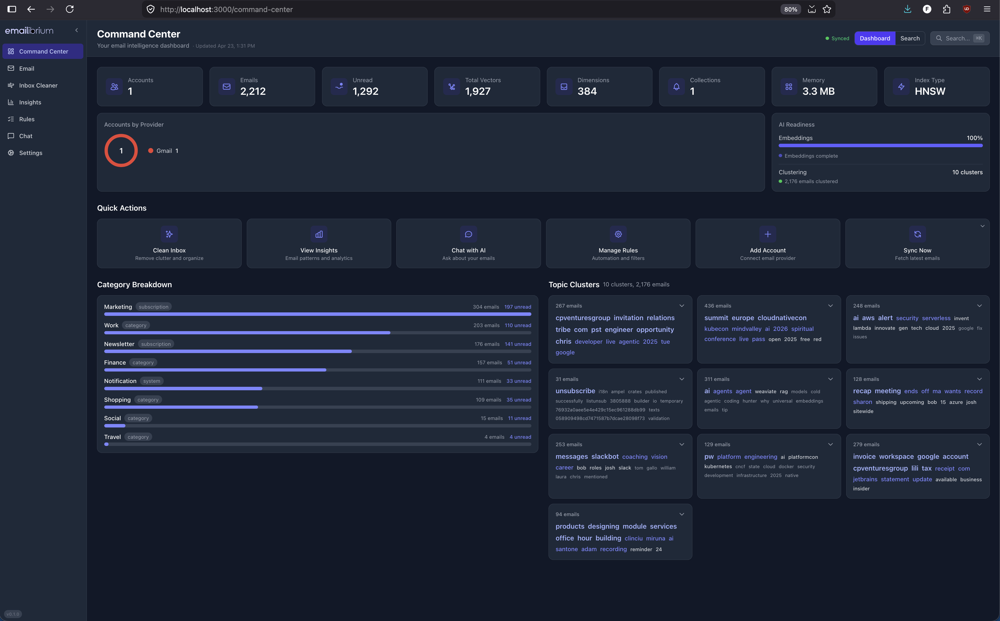
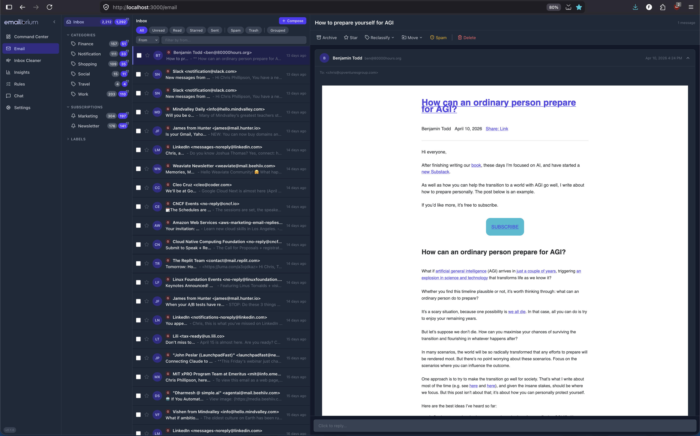
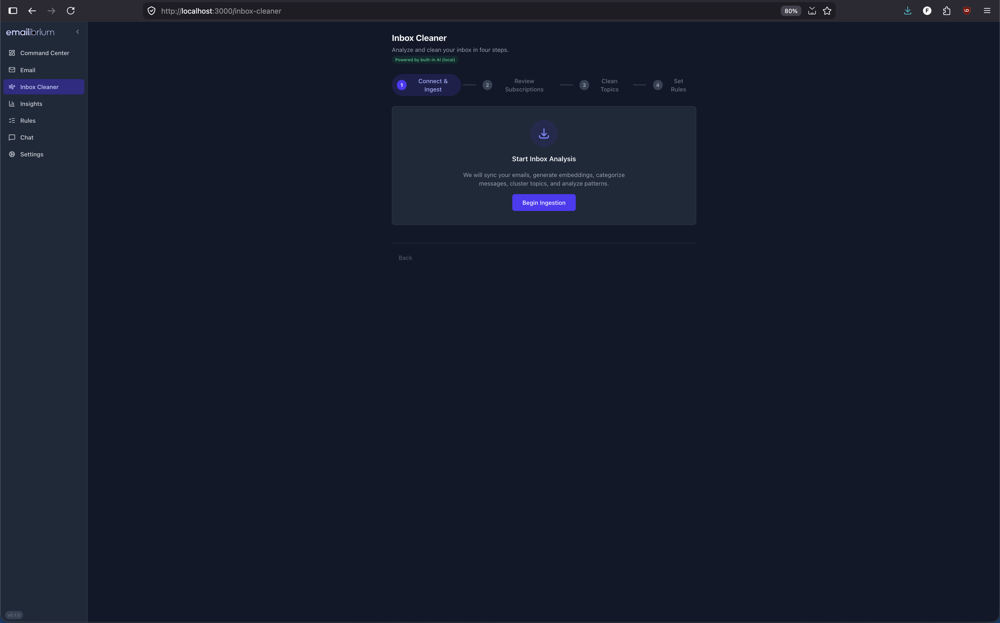
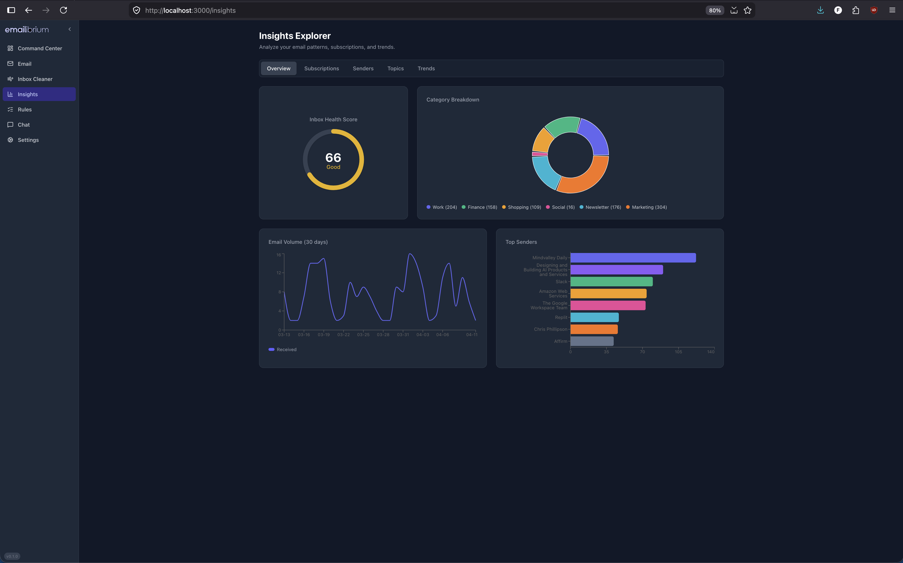
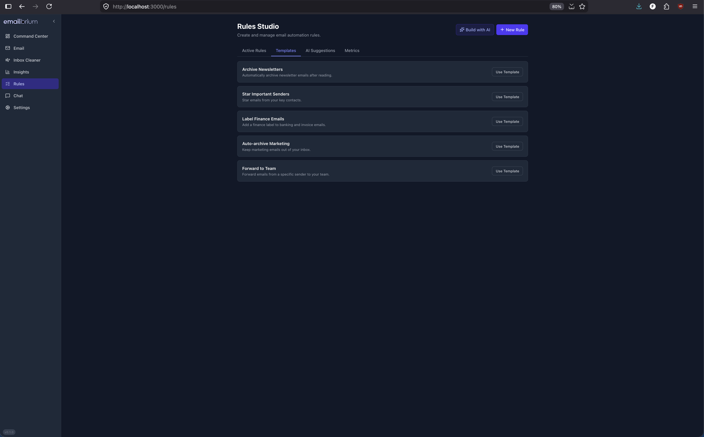
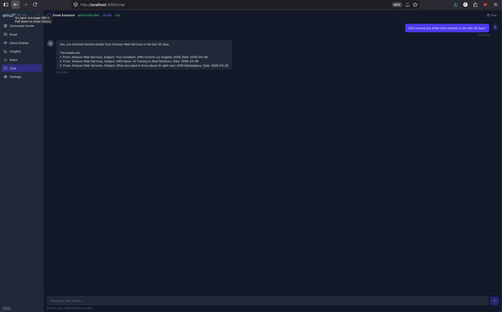
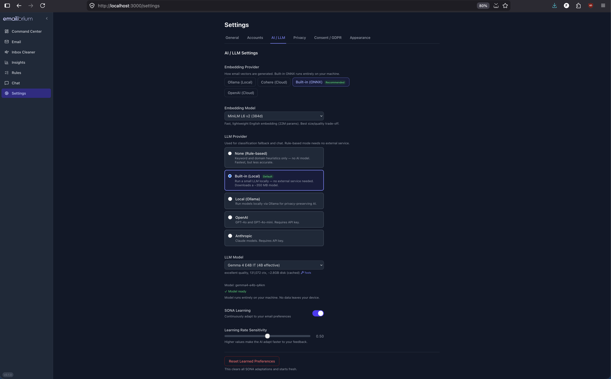

# Emailibrium 📧

**Your inbox found its balance.**

> _Email + Equilibrium = Emailibrium._ Because your inbox shouldn't feel like a second job.

[](https://github.com/pacphi/emailibrium/actions/workflows/ci.yml)
[](https://github.com/pacphi/emailibrium/actions/workflows/docker.yml)
[](https://github.com/pacphi/emailibrium/actions/workflows/release.yml)
[](https://github.com/pacphi/emailibrium/actions/workflows/check-links.yml)
[](https://github.com/pacphi/emailibrium/releases)
[](https://opensource.org/licenses/MIT)

Emailibrium is a **vector-native email intelligence platform** that replaces keyword search and manual filters with semantic understanding. Connect your accounts, and in under 10 minutes it clusters, classifies, and cleans 10,000+ emails — then keeps learning from every interaction.

🔒 **No cloud processing. No data leaving your machine.** Just fast, private, intelligent email.

---

## 💡 Why Emailibrium?

Most email tools treat your inbox like a database — keyword filters, folder rules, manual sorting. Emailibrium treats it like a **living knowledge graph**. Here's what makes it different:

- 🧬 **Semantic, not syntactic** — understands meaning, not just keywords. "Call with the London team about Q3" matches even if you search for "UK quarterly meeting."
- 🏠 **100% local by default** — your emails, embeddings, and models never leave your machine. No SaaS subscriptions, no data brokers, no surprises.
- ⚡ **10,000 emails in 10 minutes** — HNSW vector indexing and batch classification deliver inbox zero at a pace no manual approach can match.
- 🔄 **Gets smarter with you** — SONA adaptive learning updates classifications from every correction you make, so the system improves continuously without retraining.
- 🌐 **Any account, one brain** — Gmail, Outlook, IMAP — unified under a single semantic search layer and shared intelligence model.
- 🛡️ **Enterprise-grade encryption, zero cloud risk** — AES-256-GCM at rest, Argon2id key derivation, Web Crypto API. Your privacy is a hard guarantee, not a policy.

---

## 📸 Screenshots

<p align="center">
  
  &nbsp;
  
</p>

<p align="center">
  <em>Command Center</em>&nbsp;&nbsp;&nbsp;&nbsp;&nbsp;&nbsp;&nbsp;&nbsp;<em>Email Reader</em>
</p>

<p align="center">
  
  &nbsp;
  
</p>

<p align="center">
  <em>Inbox Cleaner Wizard</em>&nbsp;&nbsp;&nbsp;&nbsp;&nbsp;&nbsp;&nbsp;&nbsp;<em>Insights Explorer</em>
</p>

<p align="center">
  
  &nbsp;
  
</p>

<p align="center">
  <em>Rules Studio</em>&nbsp;&nbsp;&nbsp;&nbsp;&nbsp;&nbsp;&nbsp;&nbsp;<em>Chat Assistant</em>
</p>

<p align="center">
  
</p>

<p align="center">
  <em>Settings</em>
</p>

---

## ✨ What It Does

| Capability                         | How                                                                                      |
| ---------------------------------- | ---------------------------------------------------------------------------------------- |
| 🔍 **Semantic search**             | Find "that budget spreadsheet from Sarah" — not just emails containing the word "budget" |
| ⚡ **10-minute inbox zero**        | Guided cleanup wizard with batch actions across thousands of emails                      |
| 📬 **Subscription intelligence**   | Auto-detects 47 newsletters you forgot you signed up for                                 |
| 🗂️ **Topic clustering**            | Emails self-organize into projects, threads, and themes                                  |
| 🧠 **Continuous learning**         | Every click, star, and archive makes search and classification smarter                   |
| 📱 **Multi-account unified inbox** | Gmail, Outlook, IMAP — one interface, one search, one brain                              |

## ⚙️ How It Works

```text
Email arrives → Embed as vector → Classify via centroid similarity → Cluster by topic → Archive
                    ↓                        ↓                           ↓
              Searchable in <50ms    Learns from corrections    Groups evolve over time
```

Under the hood: HNSW vector indexing, Reciprocal Rank Fusion hybrid search, GraphSAGE-inspired clustering, 3-tier adaptive learning (SONA), and AES-256-GCM encryption at rest. All running locally in Rust.

## 🚀 Quick Start

```bash
# Clone
git clone https://github.com/pacphi/emailibrium.git
cd emailibrium

# Guided setup (recommended for first time)
just setup            # interactive wizard: prerequisites, secrets, AI, Docker

# Option A: Native
just install
just dev
# → Backend: http://localhost:8080  Frontend: http://localhost:3000

# Option B: Docker
just setup-secrets    # generate dev secrets (first time only)
just docker-up-dev    # start with hot-reload
```

**Prerequisites:** Rust 1.97+, Node.js 26 (LTS)+, pnpm 11.5+ — or just Docker. See [Setup Guide](docs/setup-guide.md) for details.

> **⏱️ Want value in 15 minutes with no cloud setup?** Connect a personal Gmail (or Yahoo,
> iCloud, Fastmail, Zoho) account via **IMAP + an app password** — no Google Cloud or Azure
> project required. See **[QUICKSTART.md](QUICKSTART.md)**. (Outlook.com and Google Workspace
> require the OAuth path; see the [OAuth Setup Guide](docs/oauth-setup-guide.md).)

## 🏗️ Architecture

```text
React TypeScript SPA ──REST + SSE──→ Axum API Gateway
         │                                │
    TanStack Router                  Intelligence Layer
    TanStack Query              ┌─────────┼─────────┐
    Zustand + PWA               │    RuVector Engine  │
                                │  HNSW · SONA · GNN  │
                                └─────────┼─────────┘
                                     Data Layer
                                SQLite · Redis · REDB
```

- 🦀 **Backend:** Rust (Axum 0.8), SQLite, 22 vector intelligence modules (ONNX/fastembed default embeddings)
- ⚛️ **Frontend:** React 19, TypeScript, Tailwind CSS, 8 features, PWA-ready
- 🔒 **Privacy:** All embeddings generated and stored locally. Cloud is opt-in, never required.

## 🎯 Features at a Glance

- 🔍 **Command Center** — search hub with Cmd+K palette
- 🧹 **Inbox Cleaner** — 4-step guided cleanup wizard
- 📊 **Insights Explorer** — charts, subscription analytics, health score
- 📧 **Email Client** — view, reply, compose with thread view
- 🤖 **Rules Studio** — AI-suggested rules with semantic conditions
- ⚙️ **Settings** — per-account config, encryption, appearance

## 🔌 MCP Server

Emailibrium embeds a [Model Context Protocol](https://modelcontextprotocol.io) server in the
backend, so any MCP-capable client — Claude Code, Claude Desktop, or the built-in chat — can
read your mailbox through the same services the REST API uses. It runs inside the existing
Axum process; there is no second port and no separate daemon.

**Endpoint:** `http://localhost:8080/api/v1/mcp` (Streamable HTTP)

15 read-only tools, grouped by what they touch:

| Area     | Tools                                                                                                                             |
| -------- | --------------------------------------------------------------------------------------------------------------------------------- |
| Email    | `search_emails`, `get_email`, `list_recent_emails`, `count_emails`, `get_email_thread`, `find_similar_emails`, `list_attachments` |
| Insights | `get_insights`, `list_subscriptions`, `list_clusters`, `get_learning_metrics`                                                     |
| Accounts | `list_accounts`, `get_sync_status`                                                                                                |
| Rules    | `list_rules`                                                                                                                      |
| Cleanup  | `preview_cleanup_plan`                                                                                                            |

Alongside the tools, three resources (`email://{id}`, `thread://{key}`, `insights://summary`)
expose stable read-only views, and two prompts (`triage-inbox`, `weekly-report`) package the
common multi-step workflows.

Every tool is read-only — nothing sends, deletes, or modifies mail. Action tools are
deliberately deferred (see [ADR-028](docs/ADRs/ADR-028-mcp-tool-calling-chat.md)).

Three behaviours are worth knowing before you rely on a result:

- **`preview_cleanup_plan` is strictly a dry run.** It builds a plan in memory, marks the
  payload `"dry_run": true` / `"persisted": false`, and saves nothing. The plan id it returns
  is **ephemeral** and will not resolve via `GET /api/v1/cleanup/plan/:id`. To get a plan you
  can actually apply, create one through the REST endpoint.
- **`get_learning_metrics` counters are process-local and reset when the backend restarts.**
  They are not lifetime totals, so don't read them as historical figures.
- **`list_accounts` applies no status filter.** Disconnected, errored, and suspended accounts
  all appear; check the `status` and `is_active` fields rather than treating presence in the
  list as a working account.

> **Localhost only.** The whole `/api/v1` surface, MCP included, is unauthenticated by design —
> emailibrium is a local-first single-user app. Do not expose port 8080 beyond localhost.
> Bearer auth is a prerequisite for any non-localhost deployment.

See [Connecting an MCP client](docs/setup-guide.md#connecting-an-mcp-client) for client setup.

## 📚 Documentation

### 👥 For Everyone

| Document                                                   | Description                                   |
| ---------------------------------------------------------- | --------------------------------------------- |
| [User Guide](docs/user-guide.md)                           | Getting started, features, keyboard shortcuts |
| [UI Overview](docs/user-interface-overview.md)             | Visual tour — screenshots of every screen     |
| [Deployment Guide](docs/deployment-guide.md)               | Install, Docker, production setup             |
| [Configuration Reference](docs/configuration-reference.md) | Every config key, default, and env override   |

### 👩‍💻 For the Team

| Document                                     | Description                                                  |
| -------------------------------------------- | ------------------------------------------------------------ |
| [Maintainer Guide](docs/maintainer-guide.md) | Developer, designer, operator, security, and PM perspectives |
| [Architecture](docs/architecture.md)         | 4-tier system design, bounded contexts, data flow            |
| [Releasing](docs/releasing.md)               | Version, tag, changelog, Docker image publishing             |
| [API Spec](docs/api/openapi.yaml)            | OpenAPI 3.0 — all 12 endpoints with schemas                  |

### 🏛️ Architecture Decisions

See all ADRs in [docs/ADRs](https://github.com/pacphi/emailibrium/tree/main/docs/ADRs).

### 🗺️ Domain Model

See all DDDs in [docs/DDDs](https://github.com/pacphi/emailibrium/tree/main/docs/DDDs).

### 🔬 Research & Evaluation

| Document                                                             | Description                                  |
| -------------------------------------------------------------------- | -------------------------------------------- |
| [Research: Initial Evaluation](docs/research/initial.md)             | Academic evaluation with 30 citations        |
| [Research: LLM Options](docs/research/llm-options.md)                | ONNX, Ollama, cloud — tiered AI architecture |
| [Search Quality](backend/docs/evaluation/search-quality.md)          | Recall, NDCG, MRR methodology                |
| [Classification](backend/docs/evaluation/classification-accuracy.md) | Macro-F1, per-category P/R                   |
| [Clustering](backend/docs/evaluation/clustering-quality.md)          | Silhouette, ARI, detection metrics           |
| [Performance](backend/docs/evaluation/performance.md)                | Benchmarks and memory profiling              |
| [Domain Adaptation](docs/evaluation/domain-adaptation.md)            | Model switching, multilingual                |
| [Inbox Zero Protocol](docs/evaluation/inbox-zero-protocol.md)        | User study design                            |

## 🛠️ Development

```bash
just --list              # see all available targets
just ci                # format-check + lint + typecheck + test
just test              # backend (Rust) + frontend (Vitest)
just docker-up-dev     # full stack with hot-reload
just upgrade           # upgrade all dependencies
just outdated          # check what's stale
```

See the [Maintainer Guide](docs/maintainer-guide.md) for the full developer experience.

## 🔧 Tech Stack

| Layer               | Technology                                                                                            |
| ------------------- | ----------------------------------------------------------------------------------------------------- |
| Backend             | Rust, Axum 0.8, SQLite (SQLx), Moka cache                                                             |
| Vector Intelligence | HNSW indexing, SONA learning, GraphSAGE-inspired clustering, adaptive quantization (scalar/PQ/binary) |
| Frontend            | React 19, TypeScript 6.0, Vite 8, TanStack Router + Query, Zustand, Tailwind CSS                      |
| UI Components       | shadcn/ui pattern, Radix primitives, cmdk, Recharts, Framer Motion                                    |
| Infrastructure      | Docker Compose, GitHub Actions CI, Dependabot, Husky + lint-staged                                    |
| Security            | AES-256-GCM encryption at rest, Argon2id KDF, Web Crypto API, CSP headers                             |

## 📄 License

MIT

---

_Emailibrium: where email finds its equilibrium._
