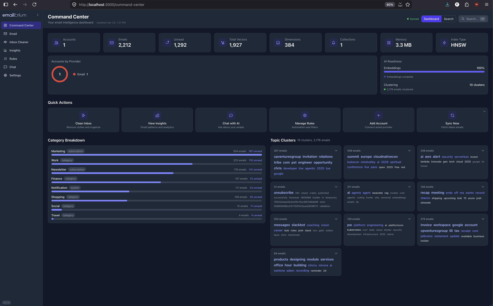
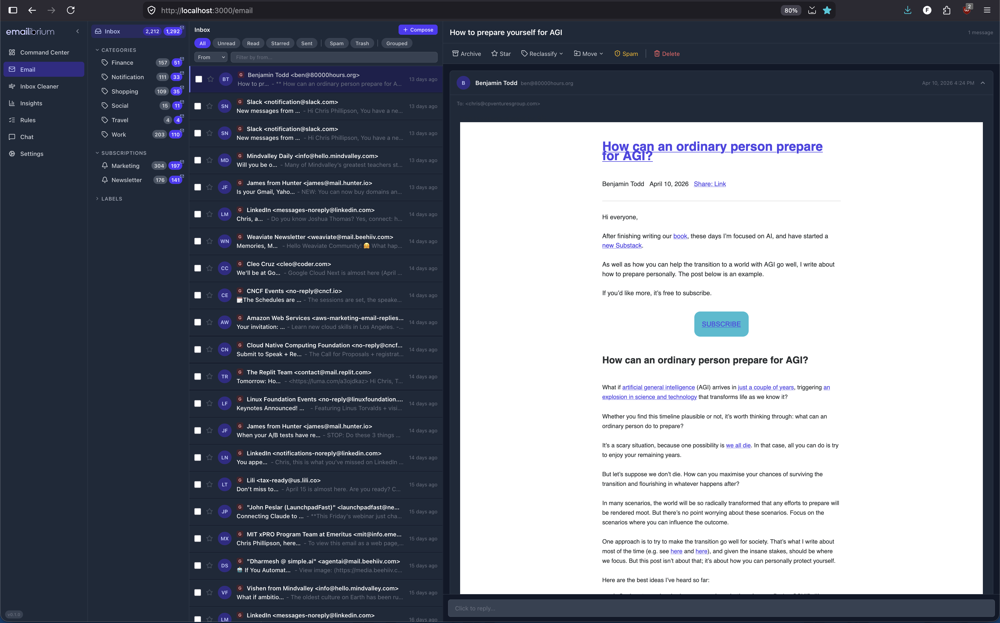
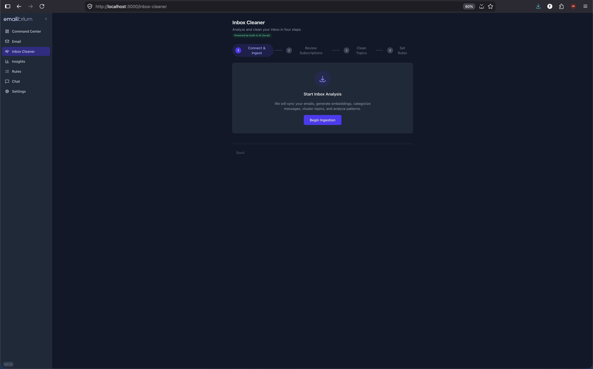
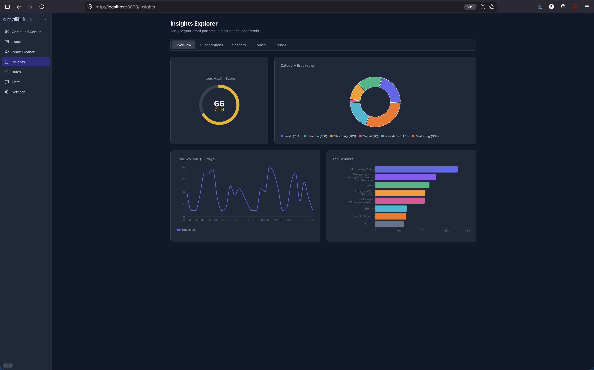
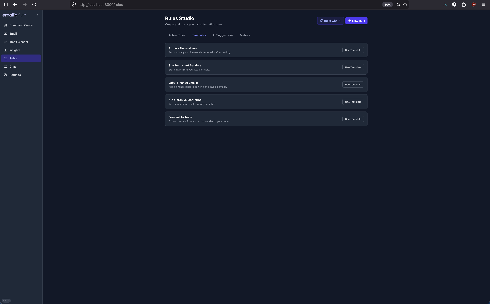
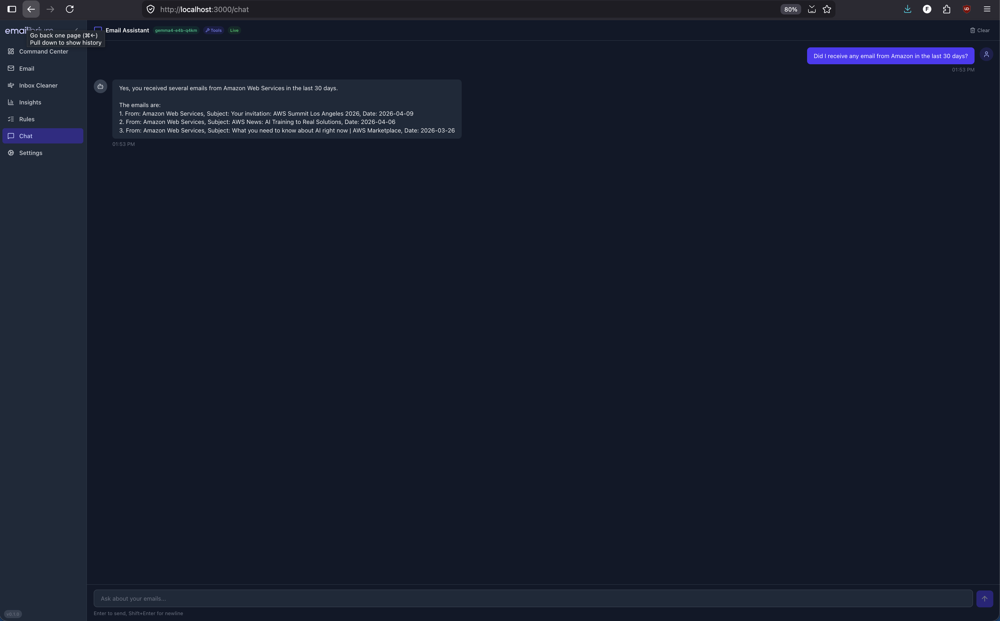
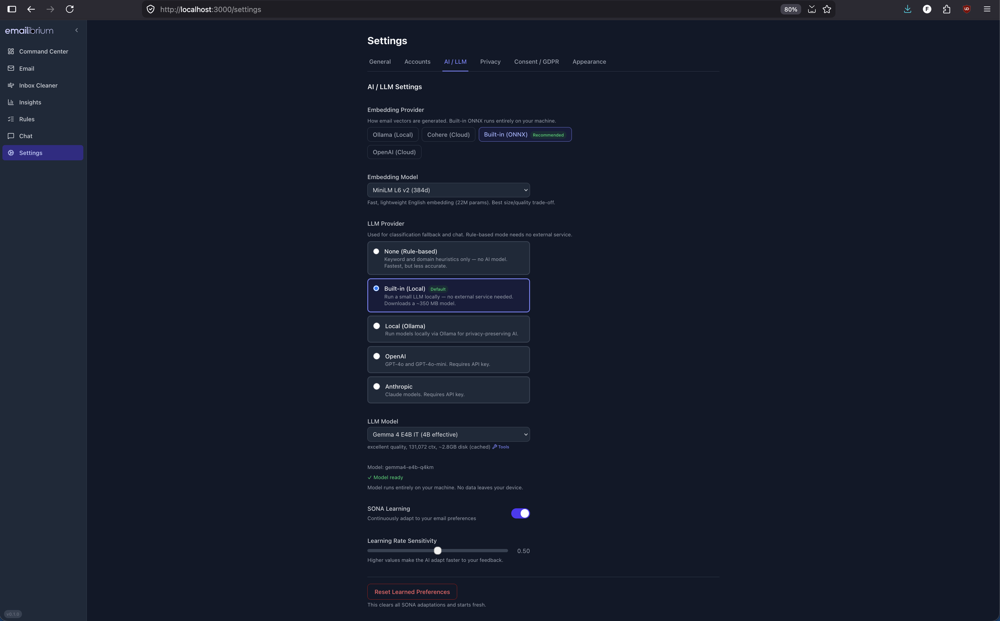

# Screenshots

A visual tour of Emailibrium's UI. Click any thumbnail to jump to the full-size image and a short description of what that screen does.

## Gallery

<table>
  <tr>
    <td align="center" width="33%">
       
      <b>Command Center</b>
    </td>
    <td align="center" width="33%">
       
      <b>Email reader</b>
    </td>
    <td align="center" width="33%">
       
      <b>Inbox Cleaner wizard</b>
    </td>
  </tr>
  <tr>
    <td align="center">
       
      <b>Insights</b>
    </td>
    <td align="center">
       
      <b>Rules Studio</b>
    </td>
    <td align="center">
       
      <b>Chat</b>
    </td>
  </tr>
  <tr>
    <td align="center">
       
      <b>Settings</b>
    </td>
    <td></td>
    <td></td>
  </tr>
</table>

---

## Command Center

The search-first home screen. A unified semantic search bar finds "that budget spreadsheet from Sarah" rather than just matching keywords, backed by HNSW vector indexing and Reciprocal Rank Fusion hybrid ranking. Hit Cmd+K to open the command palette and jump to any feature, account, or recent conversation in a single keystroke.

## Email reader

The full email client: threaded conversations, a clean reading pane, reply and compose, and fast navigation across accounts. Messages appear in a unified inbox spanning Gmail, Outlook, and IMAP, with cluster and topic context shown inline so you always know which project a thread belongs to.

## Inbox Cleaner wizard

A four-step guided cleanup wizard designed to take an inbox of 10,000+ emails to zero in under ten minutes. Emails are bucketed by sender, subscription, topic, and age; each step offers batch archive, delete, and unsubscribe actions with a preview before anything is committed.

## Insights

Charts and analytics over your mail: volume trends, top senders, subscription intelligence (including the newsletters you forgot you signed up for), topic distribution, and an email health score. Useful for spotting where the noise is coming from before you open the cleaner.

## Rules Studio

Build filter rules with semantic conditions — "looks like a receipt", "is a newsletter from a retailer" — not just literal header matches. Rules can be AI-suggested from your actual behavior, previewed against existing mail to see exactly what will change, and then saved to run on every new message.

## Chat

A conversational interface over your inbox. Ask natural-language questions like "summarize this week's project threads" or "what's outstanding from my accountant?" and get answers grounded in your actual messages. Backed by the tiered AI architecture — ONNX on-device by default, Ollama or cloud models opt-in.

## Settings

Per-account configuration (Gmail, Outlook, IMAP), embedding and LLM model selection, encryption management, appearance (light/dark theme), and privacy controls. Everything related to what leaves your machine — and what stays on it — lives here.
